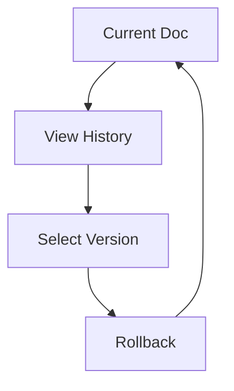

## Overview

Aforo provides powerful tools to streamline your documentation workflow. You can create, edit, collaborate, and manage versions effortlessly. Key capabilities include intuitive editing interfaces, real-time collaboration, robust version control, and advanced search with tagging.

<Columns cols={2}>
  <Card title="Document Creation & Editing" icon="edit-3" href="#document-creation">
    Build rich documents with markdown support and visual editors.
  </Card>
  <Card title="Collaboration" icon="users" href="#collaboration">
    Work together with comments and live editing sessions.
  </Card>
  <Card title="Version History" icon="git-branch" href="#version-history">
    Track changes and revert to previous versions easily.
  </Card>
  <Card title="Search & Tagging" icon="search" href="#search-tagging">
    Organize and find content quickly with tags and full-text search.
  </Card>
</Columns>

<Callout kind="tip">
  Start with the quickstart guide to set up your first project and experience these features in action.
</Callout>

## Document Creation and Editing

Create new documents directly in Aforo using the web interface or API. The editor supports markdown, rich text, and embeds.

<Steps>
  <Step title="Create a New Document" icon="plus">
    Navigate to your project dashboard and click "New Document". Choose a template or start blank.
  </Step>
  <Step title="Edit Content" icon="edit">
    Use the split-view editor to write markdown while previewing the rendered output.
  </Step>
  <Step title="Publish" icon="upload">
    Save and publish to make it live for your team.
  </Step>
</Steps>

<CodeGroup tabs="Markdown,API">
  ```markdown
  # Welcome to Aforo

  This is your first document.

  ## Features
  - Real-time collaboration
  - Version history
  ```
  ```javascript
  const response = await fetch('https://api.example.com/documents', {
    method: 'POST',
    headers: { 'Authorization': 'Bearer YOUR_API_KEY' },
    body: JSON.stringify({
      title: 'New Document',
      content: '# Welcome\nThis is markdown content.'
    })
  });
  ```
</CodeGroup>

## Collaboration Features

Invite team members to collaborate on documents. Use comments for feedback or real-time editing for live sessions.

<Tabs>
  <Tab title="Comments" icon="message-circle">
    Add inline comments to specific sections.
    
    <Steps>
      <Step title="Add Comment">
        Highlight text and select "Comment".
      </Step>
      <Step title="Resolve" icon="check">
        Reply and mark as resolved.
      </Step>
    </Steps>
  </Tab>
  <Tab title="Real-time Editing" icon="activity">
    Multiple users edit simultaneously with cursor indicators.
    
    <Callout kind="info">
      Changes sync instantly across all participants.
    </Callout>
  </Tab>
</Tabs>

## Version History and Rollback

Aforo automatically saves versions on every change. View diffs and rollback as needed.



<Expandable title="Advanced Rollback Options" default-open="false">
  Use the API for programmatic rollbacks:
  
  ````javascript
  await fetch(`https://api.example.com/documents/{docId}/rollback`, {
    method: 'POST',
    headers: { 'Authorization': 'Bearer YOUR_API_KEY' },
    body: JSON.stringify({ versionId: 'v1.2' })
  });
  ````
</Expandable>

## Search and Tagging

Organize documents with tags and leverage powerful search.

| Feature | Description |
|---------|-------------|
| Tags | Add multiple tags like `api`, `guide`, `internal` |
| Full-text Search | Query across all documents |
| Filters | Combine tags and search terms |

<Steps>
  <Step title="Add Tags" icon="tag">
    Edit document metadata and add comma-separated tags.
  </Step>
  <Step title="Search" icon="search">
    Use the global search bar with tag filters: `tag:api integration`.
  </Step>
</Steps>

<Callout kind="success">
  These features scale with your projects, handling thousands of documents efficiently.
</Callout>