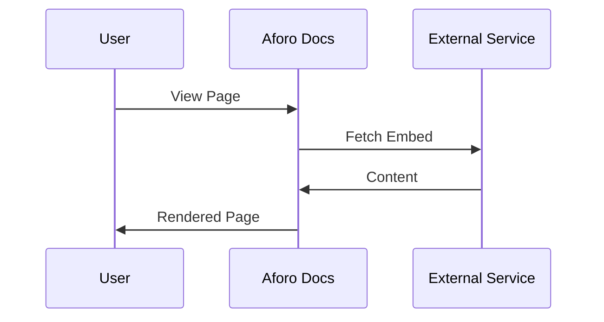

## Overview

Extend Aforo's capabilities by integrating with popular tools like GitHub for version control sync and Slack for real-time notifications. You can also set up webhooks to trigger actions on documentation updates, access the full API for custom extensions, and embed external content seamlessly into your docs. These integrations streamline your workflow and keep teams aligned.

<Callout kind="tip">
Review the [API Reference](/api-reference) for full endpoint details before implementing custom integrations.
</Callout>

## Popular Integrations

Connect Aforo with essential tools to automate documentation tasks.

<Columns cols={2}>
  <Card title="GitHub" icon="github" href="https://github.com/integration">
    Sync your documentation repository with Aforo. Push changes to GitHub and automatically publish updates to your docs site.
  </Card>
  <Card title="Slack" icon="message-circle" href="https://slack.com/integration">
    Receive notifications in Slack channels for doc publishes, comments, or version releases. Keep your team informed without leaving chat.
  </Card>
</Columns>

## Setting Up Webhooks

Webhooks enable real-time notifications when events occur in Aforo, such as document publishes or user actions. Configure them in your Aforo dashboard under Settings > Webhooks.

<Steps>
  <Step title="Create Webhook" icon="plus">
    Navigate to your project settings and select "New Webhook".
    
    Specify the target URL, such as `https://your-webhook-url.com/aforo-events`.
  </Step>
  <Step title="Select Events" icon="zap">
    Choose events like `doc.published` or `comment.added`.
    
````javascript
{
  "events": ["doc.published", "comment.added"]
}
````
  </Step>
  <Step title="Test and Save" icon="check-circle">
    Send a test payload to verify the endpoint receives data.
    
    <Callout kind="info">
    Save the webhook to activate it. Test with a real event for production use.
    </Callout>
  </Step>
</Steps>

<Request tabs="cURL,JavaScript" show-lines="true">
```bash
curl -X POST https://api.example.com/v1/webhooks \
  -H "Authorization: Bearer YOUR_API_KEY" \
  -H "Content-Type: application/json" \
  -d '{
    "url": "https://your-webhook-url.com/aforo-events",
    "events": ["doc.published"]
  }'
```

````javascript
const response = await fetch('https://api.example.com/v1/webhooks', {
  method: 'POST',
  headers: {
    'Authorization': 'Bearer YOUR_API_KEY',
    'Content-Type': 'application/json'
  },
  body: JSON.stringify({
    url: 'https://your-webhook-url.com/aforo-events',
    events: ['doc.published']
  })
});
````
</Request>

<Response tabs="200">
```json
{
  "id": "wh_1234567890",
  "url": "https://your-webhook-url.com/aforo-events",
  "events": ["doc.published"],
  "active": true
}
```
</Response>

<ParamField path="url" param-type="string" required="true">
Your publicly accessible endpoint to receive webhook payloads.
</ParamField>

<ParamField body="events" param-type="array" required="true">
Array of event names to subscribe to.
</ParamField>

## API Access for Custom Extensions

Build custom integrations using Aforo's REST API. Authenticate with your API key and interact with docs programmatically.

<Tabs>
  <Tab title="List Documents" icon="list">
    Fetch all documents in your project.
    
    <CodeGroup tabs="JavaScript,Python">
```javascript
const response = await fetch('https://api.example.com/v1/documents', {
  headers: { 'Authorization': 'Bearer YOUR_API_KEY' }
});
const docs = await response.json();
console.log(docs);
```

```python
import requests
response = requests.get(
  'https://api.example.com/v1/documents',
  headers={'Authorization': 'Bearer YOUR_API_KEY'}
)
docs = response.json()
print(docs)
```
    </CodeGroup>
  </Tab>
  <Tab title="Create Document" icon="plus">
    Create a new document via API.
    
````javascript
const newDoc = await fetch('https://api.example.com/v1/documents', {
  method: 'POST',
  headers: {
    'Authorization': 'Bearer YOUR_API_KEY',
    'Content-Type': 'application/json'
  },
  body: JSON.stringify({
    title: 'New Guide',
    content: '# Hello World\nThis is embedded content.'
  })
});
````
  </Tab>
</Tabs>

<ResponseField name="id" field-type="string" required="true">
Unique document identifier.
</ResponseField>

<ResponseField name="title" field-type="string">
Document title.
</ResponseField>

## Embedding External Content

Embed iframes, videos, or dynamic widgets from third-party services directly in your Aforo docs.

<Expandable title="Advanced Embedding Options" default-open="false">
Use the embed block syntax for secure rendering:

````markdown
<Video
  src="https://www.youtube.com/embed/dQw4w9WgXcQ"
  title="Tutorial Video"
  width="560"
  height="315"
/>

<Iframe
  src="https://example.com/dashboard"
  title="External Dashboard"
  width="100%"
  height="400"
/>
````

Ensure external sources support embedding and comply with CSP policies.
</Expandable>



<Callout kind="success">
Integrations supercharge your workflow. Start with webhooks for immediate notifications, then explore the API for deeper customization.
</Callout>